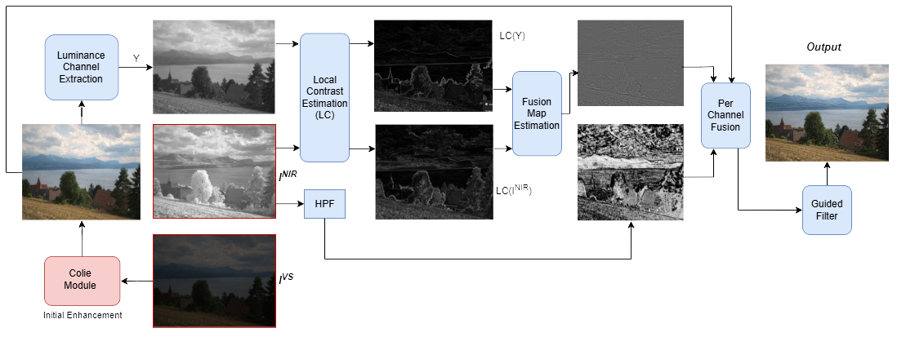

# Zero-Shot-LLIE-VIA-RGB-NIR-FUSION
A Zero-Shot approach to low light image enhancement using RGB-NIR Implicit Fusion

## Overview

Low-light conditions significantly degrade image quality, impacting both human perception and computer vision tasks. This thesis proposes a zero-shot pipeline that enhances low-light RGB images by leveraging synchronized Near-Infrared (NIR) captures. The method first uses a modified CoLIE approach to generate an initial enhancement of the RGB image's value (brightness) channel. This enhanced RGB image is then fused with structural details extracted from the corresponding NIR image. Finally, a guided filter, using the NIR image as a guide, is applied for denoising and refining the output. The "zero-shot" aspect means the model optimizes itself for each input image pair without requiring pre-trained weights on a large dataset.



## Pipeline Stages

The `combined_pipeline.py` script executes the following major steps for each RGB-NIR image pair:

1.  **Load Images**: Loads the low-light RGB image (for Colie and final fusion) and the corresponding NIR image (for fusion and guided denoising).
2.  **CoLIE Enhancement (on RGB's V-channel)**:
    *   Converts the RGB image to HSV color space.
    *   The Value (V) channel is downsampled.
    *   A SIREN-based Implicit Neural Function (INF) model (from Colie) is optimized per-image to predict an illumination map for the V-channel. This involves:
        *   Extracting patches and coordinates from the downsampled V-channel.
        *   Training the SIREN model using a composite loss function (spatial, total variation, exposure, sparsity).
    *   The enhanced V-channel is upsampled using a guided filter (with the original V-channel as guide).
    *   The HSV image is reconstructed with the enhanced V-channel and converted back to RGB. This is the "Colie enhanced RGB".
3.  **RGB-NIR Fusion**:
    *   The "Colie enhanced RGB" image (converted to OpenCV format) is fused with the NIR image.
    *   This involves calculating local contrasts, a fusion map, and extracting high-pass details from the NIR image to inject into the RGB image.
4.  **Guided Denoising**:
    *   The fused image is denoised using `cv2.ximgproc.guidedFilter` (or a fallback bilateral filter if unavailable), with the original NIR image serving as the guidance map.
5.  **Save Result**: The final enhanced and denoised image is saved.

## Features

*   **Zero-Shot Learning**: Optimizes enhancement parameters per image pair, requiring no prior large-scale training dataset.
*   **RGB-NIR Fusion**: Leverages the structural clarity of NIR images to improve detail and reduce noise in the visible spectrum.
*   **CoLIE Integration**: Utilizes the context-aware implicit neural representation from CoLIE for initial illumination enhancement.
*   **Guided Filtering**: Employs guided filters for both upsampling within Colie and final denoising, preserving edges effectively.
*   **Modular Pipeline**: Clear separation of enhancement stages.
*   **Customizable Parameters**: Allows tuning of various parameters for Colie, fusion, and denoising stages.

## Prerequisites

*   Python 3.10 (as used in the original CoLIE project)
*   PyTorch (version 2.3.1 or compatible, as used in CoLIE)
*   OpenCV (`opencv-python`)
*   NumPy
*   Pillow (PIL)
*   tqdm (for progress bars)

It is highly recommended to use a virtual environment.

## Dataset

This project was tested using the **[DATASET_NAME_HERE]**. You will need to download it to run the experiments or test the pipeline with the intended data.

**Download Instructions:**

1.  **Download the dataset:**
    *   You can download the dataset from the following link:
        [Download [DATASET_NAME_HERE]]([(https://drive.google.com/drive/folders/13yNug9MPXR1nqLD2K9R2QDxbNnoDXvjI?usp=drive_link)])
    *   *(Optional: Add any specific instructions about the download, e.g., if registration is required, if it's a large file, if it's split into parts, etc.)*

2.  **Extract the dataset (if applicable):**
    *   If the downloaded file is a `.zip`, `.tar.gz`, or similar archive, extract its contents to a known location on your computer.

3.  **Organize the dataset for the pipeline:**
    *   Once downloaded and extracted, you need to organize the RGB and NIR image pairs into separate directories as expected by the `combined_pipeline.py` script.
    *   Create two main folders, for example, `Dataset_RGB/` and `Dataset_NIR/`.
    *   Place all the low-light RGB images from the dataset into `Dataset_RGB/`.
    *   Place all the corresponding NIR images into `Dataset_NIR/`.
    *   **Crucially, ensure that an RGB image and its corresponding NIR image have the exact same filename stem (the part of the name before the extension).** For example, `Dataset_RGB/scene01.png` must correspond to `Dataset_NIR/scene01.png`.

    Your dataset directory structure should look something like this before running the script:
    ```
    path/to/your/downloaded_dataset/
    ├── Dataset_RGB/
    │   ├── image1.png
    │   ├── image2.jpg
    │   └── ...
    └── Dataset_NIR/
        ├── image1.png
        ├── image2.jpg
        └── ...
    ```

4.  **Update Script Arguments:**
    When running `combined_pipeline.py`, you will then point the `--rgb_dir` and `--nir_dir` arguments to these prepared directories:
    ```bash
    python combined_pipeline.py \
        --rgb_dir "path/to/your/downloaded_dataset/Dataset_RGB" \
        --nir_dir "path/to/your/downloaded_dataset/Dataset_NIR" \
        ... # other arguments
    ```

## Setup

1.  **Clone the repository:**
    ```bash
    git clone https://github.com/your-username/your-repo-name.git
    cd your-repo-name
    ```

2.  **Create and activate a virtual environment (recommended):**
    ```bash
    python -m venv venv
    # On Windows
    venv\Scripts\activate
    # On macOS/Linux
    source venv/bin/activate
    ```

3.  **Install dependencies:**
    A `requirements.txt` file should be created.
    ```
    # requirements.txt
    torch==2.3.1 # Or your specific CUDA/CPU version
    torchvision   # Usually installed with torch
    torchaudio    # Usually installed with torch
    numpy
    opencv-python
    Pillow
    tqdm
    ```
    Then install using:
    ```bash
    pip install -r requirements.txt
    ```
    *Note on PyTorch*: Ensure you install the correct PyTorch version for your system (CPU or specific CUDA version). Visit [https://pytorch.org/](https://pytorch.org/) for installation commands.
    *Note on OpenCV*: The `opencv-contrib-python` package might be needed if `cv2.ximgproc.guidedFilter` is used extensively and not available in the standard `opencv-python`. For this script, the fallback to `cv2.bilateralFilter` is implemented.

4.  **Ensure `colie` helper scripts are present**:
    The script imports from `utils.py`, `loss.py`, `siren.py`, and `color.py`. These files should be in the same directory as `combined_pipeline.py` or in a subdirectory named `colie/` (adjust imports in `combined_pipeline.py` if they are in a subdirectory, e.g., `from colie.utils import ...`). The current provided `combined_pipeline.py` expects them in the same directory.

## Directory Structure for Input

You need to prepare your input images in two separate directories: one for RGB images and one for corresponding NIR images.
├── combined_pipeline.py
├── utils.py
├── loss.py
├── siren.py
├── color.py
├── filter.py (if used by utils.py)
├── RGB/ # Your low-light RGB images
│ ├── image1.png
│ ├── image2.jpg
│ └── ...
├── NIR/ # Corresponding NIR images
│ ├── image1.png # Must have the same stem name as RGB
│ ├── image2.jpg
│ └── ...
└── output_combined/ # Default output directory (will be created)


**Important**: For the script to match pairs, the RGB and NIR images must have the **exact same filename stem** (the part of the name before the extension). For example, `RGB/scene01.png` will be paired with `NIR/scene01.png`.

## Usage

Run the main script from the terminal:

```bash
python combined_pipeline.py \
    --rgb_dir "path/to/your/RGB_images" \
    --nir_dir "path/to/your/NIR_images" \
    --out_dir "path/to/your/output_folder" \
    --down_size 256 \
    --epochs 100 \
    --window 7 \
    --L 0.5 \
    --alpha 1.0 \
    --beta 20.0 \
    --gamma 8.0 \
    --delta 5.0 \
    --radius 8 \
    --eps 0.001 \
    --fusion_red 0.7 \
    --fusion_hp_strength 0.7
```
## Citation
@mastersthesis{Medhi2025Thesis,
  author       = {Hirakjyoti Medhi},
  title        = {Zero-Shot Low-Light Image Enhancement via {RGB-NIR} Implicit Fusion},
  school       = {Indian Institute of Technology (Indian School of Mines), Dhanbad},
  year         = {2025},
  month        = {May},
  note         = {Admission No: 23MS0063, Degree: Master of Science}
}
